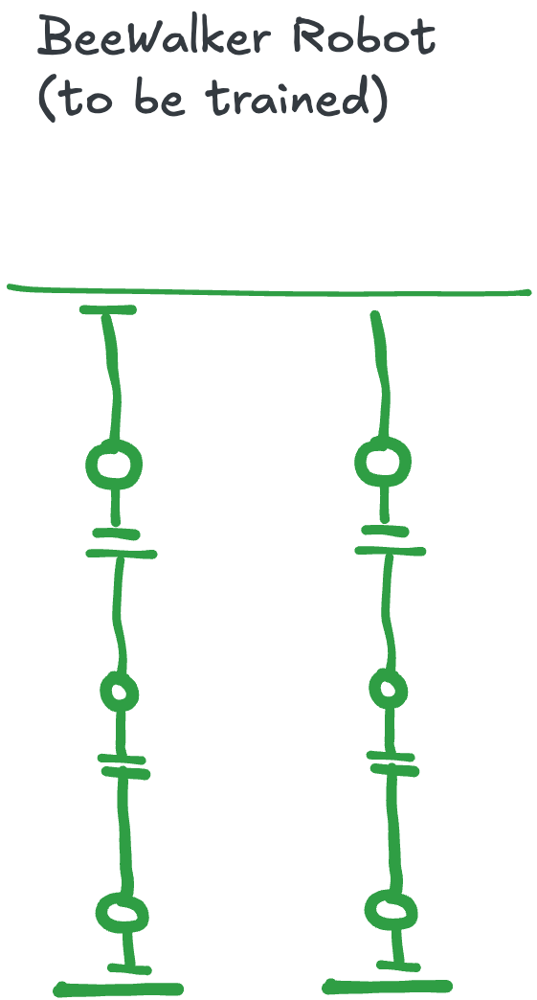

# BeeWalker Robot Documentation

A bipedal walking robot designed for reinforcement learning research with sim-to-real transfer capabilities.

## Overview

The BeeWalker is a 2-legged walking robot with 3 degrees of freedom per leg, designed for:
- Reinforcement learning locomotion research
- Sim-to-real transfer experiments
- Low-cost educational robotics



## Robot Specifications

| Parameter | Value |
|-----------|-------|
| Legs | 2 |
| Joints per leg | 3 (hip, knee, ankle) |
| Total actuators | 6 |
| Joint range | ±90° |
| Servo type | MG996R |
| Stall torque | 11.5 kg·cm @ 6V |
| Operating voltage | 4.8V - 6V |

## Architecture

```
┌─────────────────────────────────────────┐
│              Torso (Body)               │
│  ┌─────────────────────────────────┐    │
│  │  Raspberry Pi Pico RP2040       │    │
│  │  + PCA9685 PWM Driver           │    │
│  └─────────────────────────────────┘    │
├───────────────┬─────────────────────────┤
│   Right Leg   │       Left Leg          │
├───────────────┼─────────────────────────┤
│  Hip Joint    │      Hip Joint          │
│  (MG996R)     │      (MG996R)           │
├───────────────┼─────────────────────────┤
│  Knee Joint   │      Knee Joint         │
│  (MG996R)     │      (MG996R)           │
├───────────────┼─────────────────────────┤
│  Ankle Joint  │      Ankle Joint        │
│  (MG996R)     │      (MG996R)           │
├───────────────┼─────────────────────────┤
│  Foot         │      Foot               │
└───────────────┴─────────────────────────┘
```

## Files

| File | Description |
|------|-------------|
| `model.xml` | MJCF model for MuJoCo simulation |
| `view.py` | Native viewer for the model |
| `documentation/` | Technical documentation |

## Quick Start

### View the Model

```bash
# Install dependencies
pip install mujoco

# View the model
python view.py
```

### Viewer Controls

| Control | Action |
|---------|--------|
| Left mouse drag | Rotate view |
| Right mouse drag | Pan view |
| Scroll wheel | Zoom |
| Double-click | Reset camera |
| Space | Pause/Resume |
| Backspace | Reset simulation |

## MJCF Model Structure

The model is organized into:

1. **Compiler/Options**: Simulation parameters
2. **Assets**: Materials and textures
3. **Worldbody**: Physical structure
4. **Actuators**: Motor definitions
5. **Sensors**: Feedback sensors

### Joint Hierarchy

```
root (freejoint)
└── torso
    ├── right_hip (hinge, X-axis)
    │   └── right_thigh
    │       └── right_knee (hinge, X-axis)
    │           └── right_shin
    │               └── right_ankle (hinge, X-axis)
    │                   └── right_foot
    └── left_hip (hinge, X-axis)
        └── left_thigh
            └── left_knee (hinge, X-axis)
                └── left_shin
                    └── left_ankle (hinge, X-axis)
                        └── left_foot
```

### Sensors

| Sensor | Type | Location |
|--------|------|----------|
| `torso_accel` | Accelerometer | Torso center |
| `torso_gyro` | Gyroscope | Torso center |
| `torso_mag` | Magnetometer | IMU site |
| `*_hip_pos` | Joint position | Hip joints |
| `*_knee_pos` | Joint position | Knee joints |
| `*_ankle_pos` | Joint position | Ankle joints |
| `*_foot_touch` | Touch sensor | Feet |

## Hardware Integration

See [hardware.md](hardware.md) for real robot hardware details.

### Bill of Materials

| Component | Quantity | Purpose |
|-----------|----------|---------|
| Raspberry Pi Pico | 1 | Main controller |
| PCA9685 | 1 | PWM driver |
| MG996R Servo | 6 | Joint actuators |
| 6V Power Supply | 1 | Servo power |
| 3D Printed Parts | 1 set | Structural components |

## Simulation Parameters

| Parameter | Value | Description |
|-----------|-------|-------------|
| Timestep | 0.002s | Simulation step size |
| Integrator | RK4 | Runge-Kutta 4th order |
| Gravity | -9.81 m/s² | Standard Earth gravity |
| Friction | 1.0, 0.5, 0.5 | Sliding, torsional, rolling |

## Design Rationale

### Egg-Shaped Servo Housing

The bulbous ellipsoid design for servo housings:
- Reduces stress concentrations
- Provides natural load distribution
- Allows for compact cable routing
- Aesthetic "bee" inspired appearance

### Single-Axis Joints

All joints use single-axis hinge joints aligned on the X-axis:
- Simplifies control algorithms
- Matches real MG996R servo constraints
- Enables planar walking gaits
- Reduces degrees of freedom for RL

## Related Links

- [MuJoCo Documentation](https://mujoco.readthedocs.io/)
- [MG996R Datasheet](https://www.electronicoscaldas.com/datasheet/MG996R_Tower-Pro.pdf)
- [Raspberry Pi Pico](https://www.raspberrypi.com/products/raspberry-pi-pico/)
