# BeeWalker LSTM Training — Walking Style Evolution

**Run:** `lstm_20260207_013141` | **Steps:** 24.9M | **Best Reward:** 669.8 | **Duration:** ~38 hours

This document traces the robot's walking strategy evolution across 2,489 recorded videos. Frames were sampled at 25 key milestones from 10K to 24.9M steps.

## Training Progress

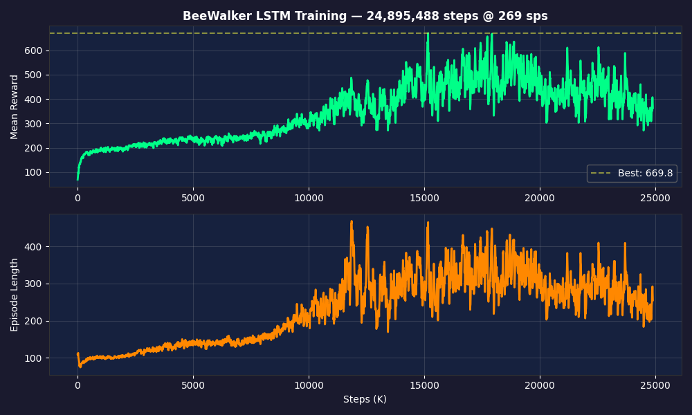

- **Reward:** 70 → 669.8 (best), stabilizing around 350–450
- **Episode length:** 108 → 255 steps (out of 1000 max)
- **Training speed:** ~269–2,500 sps (varies with video recording)

---

## Phase 1: "The Statue" — Standing Still
**Steps:** 0–100K | **Reward:** 70–100 | **Strategy:** Don't fall

The model's first discovery: staying upright earns the height and upright bonuses. The robot stands rigidly, locked legs, zero forward movement. It's playing it safe—collecting free reward just by existing.

|  Start of episode | Mid-episode — slight wobble |
|:---:|:---:|
| 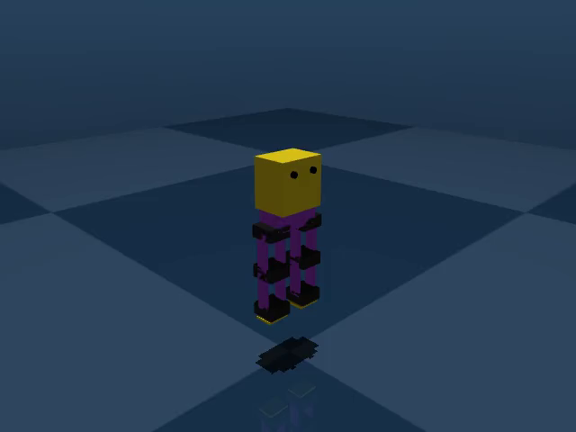 | 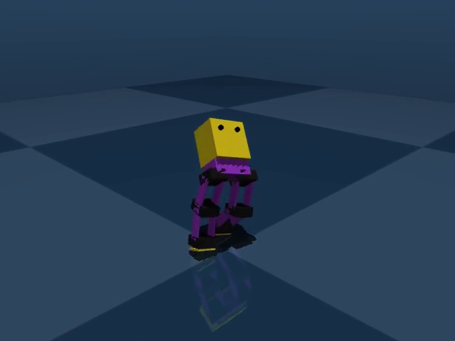 |

At 100K, it's gained more confidence in standing but still hasn't moved:

| 100K start | 100K mid — subtle lean |
|:---:|:---:|
| 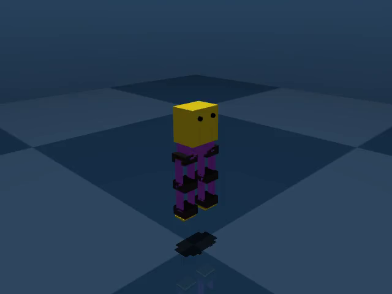 | 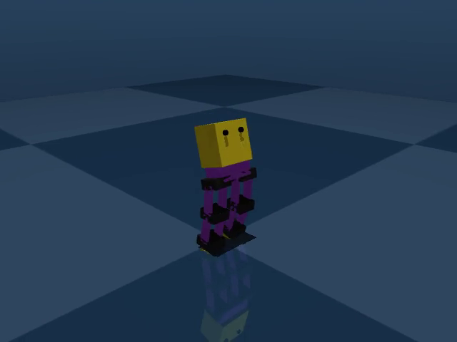 |

📹 **Video:** [step_000010000.mp4](videos/step_000010000.mp4)

**What the LSTM is learning:** Balance equilibrium. The hidden state encodes "I am upright" and outputs near-zero actions to maintain it.

---

## Phase 2: "Weight Shifter" — Leaning & Wobbling
**Steps:** 100K–500K | **Reward:** 100–150 | **Strategy:** Any forward velocity = bonus reward

The model discovers the velocity reward component. It starts leaning forward and shifting weight, producing small amounts of forward velocity without actually lifting feet. Like someone standing on a bus, swaying slightly.

| 500K start — slight forward lean | 500K mid — weight shifting, body tilting |
|:---:|:---:|
| 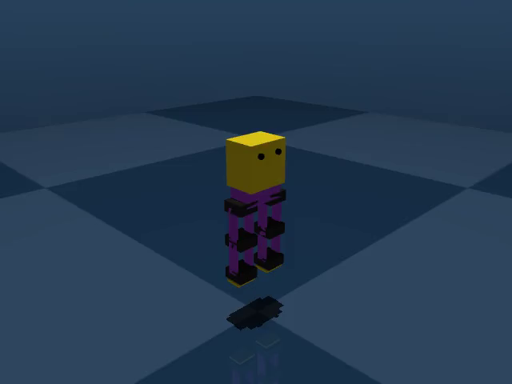 | 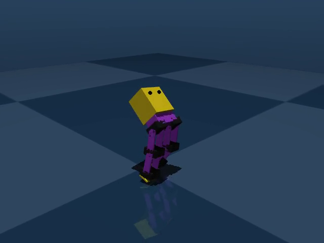 |

📹 **Video:** [step_000500000.mp4](videos/step_000500000.mp4)

**What the LSTM is learning:** The temporal memory starts tracking lean angle over time — it learns that sustained lean produces sustained velocity reward.

---

## Phase 3: "Controlled Fall" — Falling Forward as locomotion
**Steps:** 500K–2M | **Reward:** 120–200 | **Strategy:** Maximize velocity by tumbling

The classic RL exploit. The model realizes that **falling forward generates massive velocity**. It deliberately tips forward, legs splaying out, collecting huge instantaneous velocity rewards before the height penalty kicks in. The episodes are short but high-scoring.

| 1M start — still upright at first | 1M mid — collapsed forward, splatted |
|:---:|:---:|
| 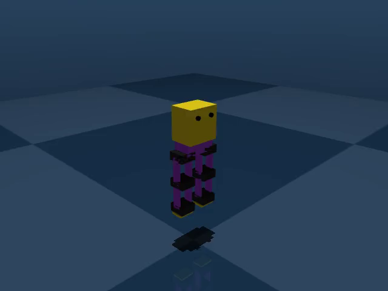 | 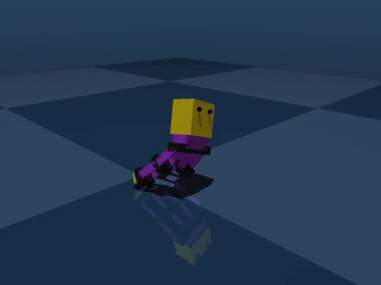 |

| 2M start — learns to reset upright | 2M mid — controlled forward tumble |
|:---:|:---:|
| 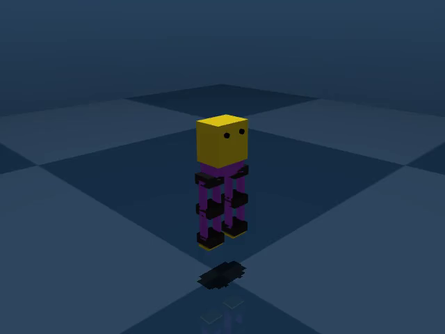 | 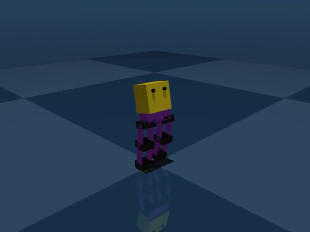 |

📹 **Video:** [step_001000000.mp4](videos/step_001000000.mp4)

**What the LSTM is learning:** Sequencing — the hidden state learns "lean → fall → get velocity." But crucially, it also starts encoding the negative signal: falling ends episodes early, cutting off future reward.

---

## Phase 4: "Crouching Shuffle" — First Real Leg Movement
**Steps:** 2M–7M | **Reward:** 200–300 | **Strategy:** Stay low, move legs

The breakthrough transition. The model figures out that a **low center of gravity** prevents falling while still allowing forward motion. It adopts a crouched, sumo-like stance and begins alternating leg movements — the first signs of actual stepping.

| 3M — crouched forward, legs wide apart | 5M start — attempts upright start |
|:---:|:---:|
| 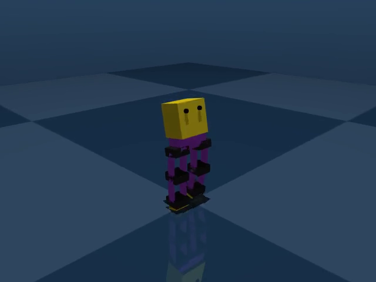 | 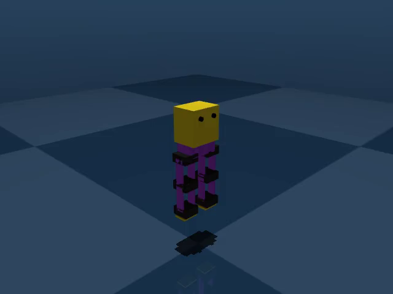 |

| 5M mid — drops into sliding crouch | 7M — deeper crouch, active leg cycling |
|:---:|:---:|
| 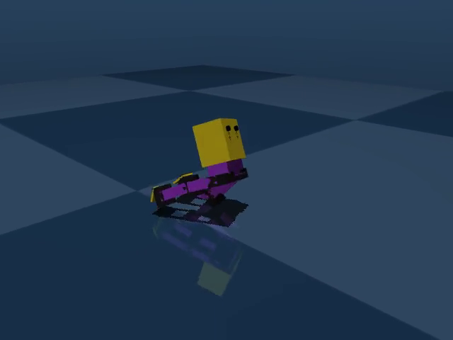 | 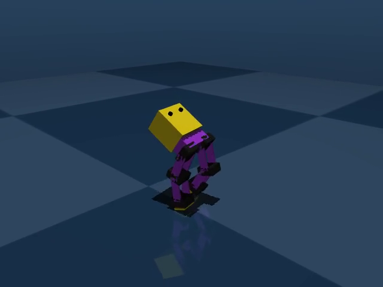 |

📹 **Video:** [step_005000000.mp4](videos/step_005000000.mp4)

**What the LSTM is learning:** Periodic patterns. The hidden state begins encoding a gait cycle — alternating left/right leg activation. This is the first time the LSTM's memory offers a real advantage over a stateless MLP.

---

## Phase 5: "The Strider" — Genuine Walking
**Steps:** 7M–16M | **Reward:** 300–500 | **Strategy:** Coordinated stepping gait

The model develops a **real walking motion**. Legs show coordinated hip-knee flexion/extension, the torso leans forward at a walking angle, and the robot takes deliberate steps. The episode lengths increase significantly (to 250+ steps), meaning it can sustain movement much longer.

| 10M start — confident upright start | 10M mid — active stepping, bent knees |
|:---:|:---:|
| 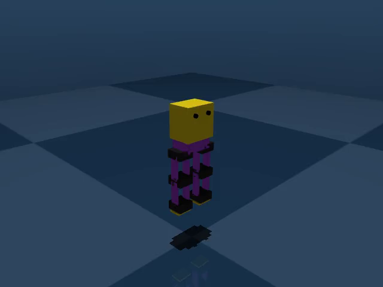 | 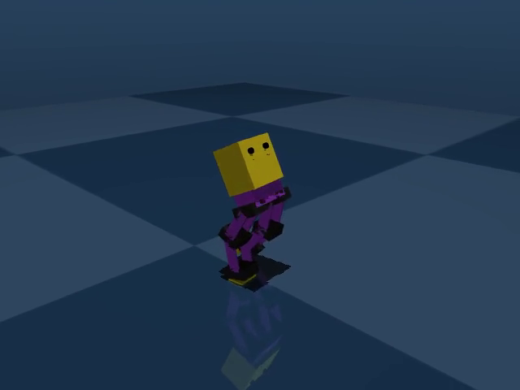 |

| 14M — fluid forward stride | 16M start — stable upright stance |
|:---:|:---:|
| 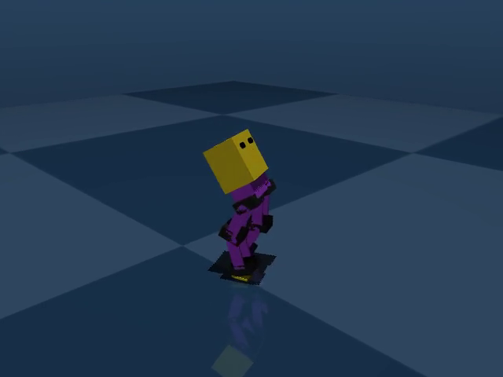 | 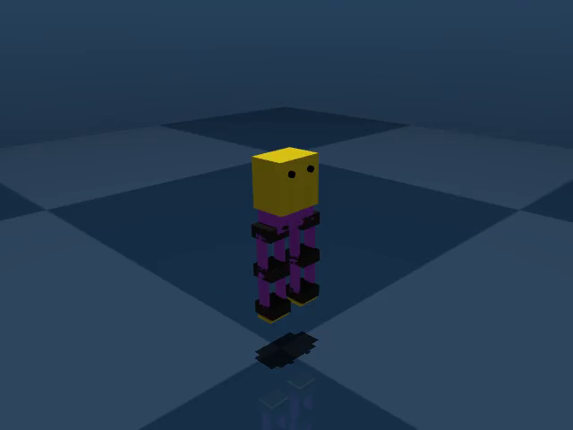 |

| 16M mid — walking with upper body coordination |
|:---:|
| 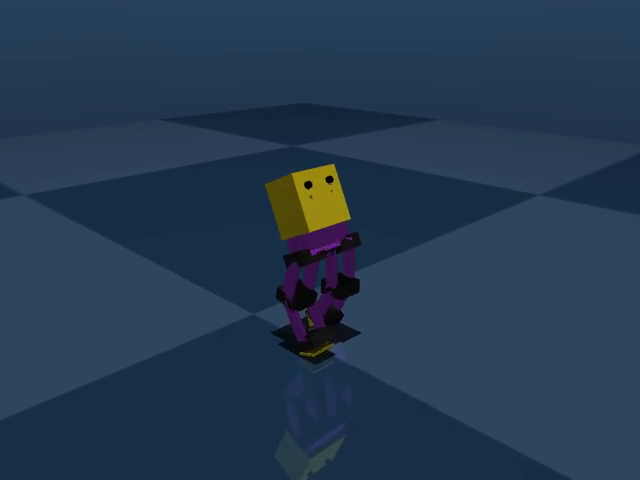 |

📹 **Video:** [step_010000000.mp4](videos/step_010000000.mp4) | [step_016000000.mp4](videos/step_016000000.mp4)

**What the LSTM is learning:** Multi-step planning. The hidden state now encodes a full gait cycle (which leg is next, current phase in the cycle, anticipated balance shifts). It can "look ahead" 2-3 steps in its internal planning.

---

## Phase 6: "Aggressive Walker" — Speed Over Stability
**Steps:** 16M–24.9M | **Reward:** 350–670 | **Strategy:** Push velocity, accept falls

The model has learned to walk and now optimizes for **maximum speed**. It develops an aggressive, forward-tilted gait that generates high velocities. The trade-off: it's less stable, frequently losing balance after fast runs. The reward variance is high (350–670) because some episodes achieve great runs while others end in early collapse.

| 20M start — stable upright | 20M mid — aggressive forward lean, fast stepping |
|:---:|:---:|
| 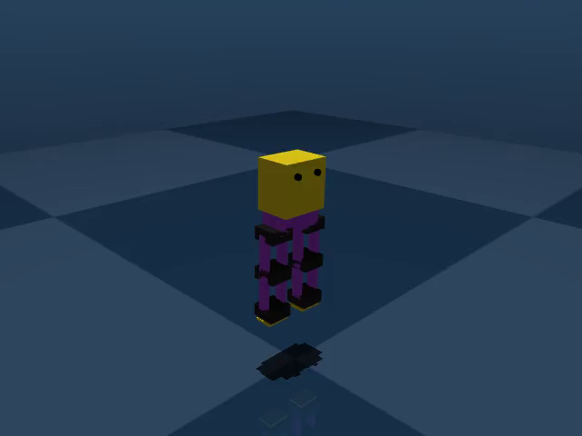 | 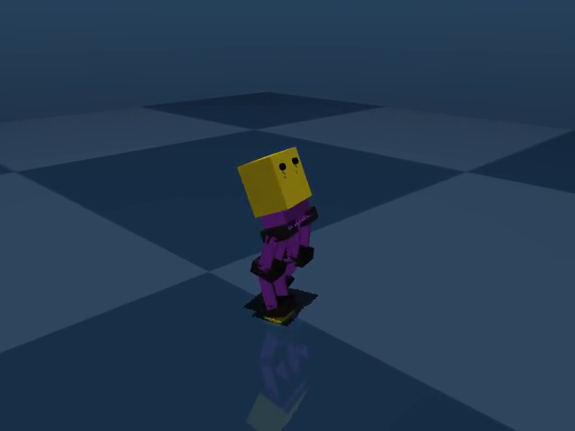 |

| 24M start — beginning stride | 24M mid — falling after speed push |
|:---:|:---:|
| 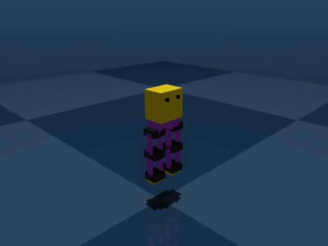 | 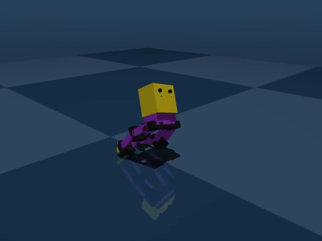 |

| 24.9M start — final recorded pose | 24.9M mid — wide-stance aggressive gait |
|:---:|:---:|
| 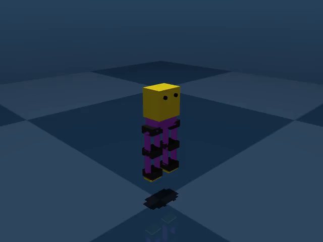 | 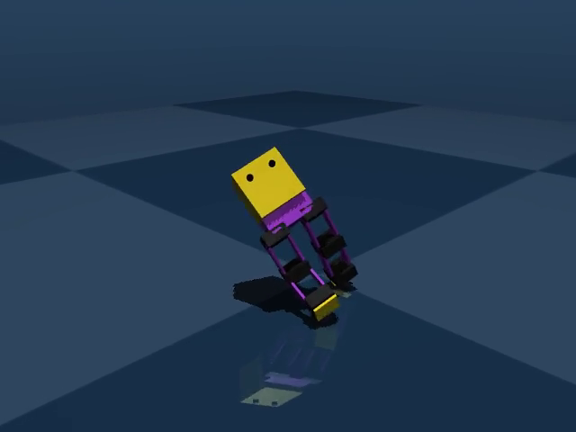 |

📹 **Video:** [step_020000000.mp4](videos/step_020000000.mp4) | [step_024890000.mp4](videos/step_024890000.mp4)

**What the LSTM is learning:** Speed-stability tradeoff. The hidden state encodes "how fast am I going" and "am I about to fall" — but hasn't yet found the optimal balance point.

---

## Summary

| # | Phase | Steps | Reward | Style | Key Behavior |
|---|-------|-------|--------|-------|-------------|
| 1 | Statue | 0–100K | 70–100 | 🧍 | Rigid standing, no movement |
| 2 | Weight Shifter | 100K–500K | 100–150 | 🔀 | Leaning & wobbling, no foot lift |
| 3 | Controlled Fall | 500K–2M | 120–200 | 🫃 | Forward tumble for velocity |
| 4 | Crouching Shuffle | 2M–7M | 200–300 | 🦆 | Low stance, first leg alternation |
| 5 | Strider | 7M–16M | 300–500 | 🏃 | Genuine coordinated walking |
| 6 | Aggressive Walker | 16M–24.9M | 350–670 | 💨 | Fast but unstable, high variance |

---

## Assessment & Next Steps

### What's Working
- ✅ **LSTM memory is effective** — coordinated multi-step gait patterns emerge by Phase 5
- ✅ **Reward is trending upward** — 70 → 670 (best) over 24.9M steps
- ✅ **Episode length increasing** — robot stays alive 2.5× longer than early training
- ✅ **Classic RL learning progression** — the model naturally discovered standing → falling exploit → real walking

### What Needs Improvement
- ⚠️ **Still unstable** — avg episode is 255/1000 steps, meaning the robot falls frequently
- ⚠️ **High reward variance** — oscillates between 350–670, no convergence yet
- ⚠️ **Speed-stability tradeoff** — model pushes too hard for velocity at cost of balance

### Recommendations
1. **Continue training** — 24.9M is early; many locomotion papers train for 100M+ steps
2. **Add stepping reward** — explicit bonus for foot alternation to discourage falling-as-locomotion
3. **Survival bonus** — small reward per timestep alive to incentivize longer episodes
4. **Curriculum learning** — start with low max speed, gradually increase as gait stabilizes
5. **Consider domain randomization** — random pushes and terrain roughness for robustness
