# BeeWalker Training — What We've Learned

*Last updated: Feb 13, 2026*

---

## Goal Reminder

Train a bipedal walking policy in MuJoCo that runs on an **RP2040** (133 MHz, 264KB RAM, 2MB flash) controlling 6 MG996R servos. The simulation must be accurate enough for sim-to-real transfer.

---

## Training History

| # | Era | Dates | Approach | Steps | Best Reward | Outcome |
|---|-----|-------|----------|-------|-------------|---------|
| 1 | Evolutionary | Jan 31 | CMA-ES parameterized sine gaits | N/A | N/A | Proof of concept |
| 2 | PPO Sweep | Feb 1 | 6 reward configs (MLP) | ~10M each | Varied | "speed" config won |
| 3 | Speed PPO | Feb 2–3 | Long training on "speed" (MLP) | **405M** | High | Diminishing returns past ~100M |
| 4 | LSTM v1 | Feb 7 | RecurrentPPO, 4 envs, LR 3e-4 | **24.9M** | **669.8** | Natural 6-phase gait evolution |
| 5 | LSTM v2 | Feb 8–9 | RecurrentPPO, 10 envs, LR 3e-4 | **17.5M** | **874.6** | 🏆 Best model ever |
| 6 | LSTM Resume | Feb 9 | Resume from #5, intended LR 1e-4 | 17.5M→24.1M | 874.6→~300 | ❌ Failed — degraded |
| 7 | LSTM + Penalty | Feb 9–10 | Standing-still penalty (-2.0), LR fix | **20.3M** | **436.4** | ✅ Real walking, no standing exploit |
| 8 | LSTM + Curriculum | Feb 10 | Progressive push difficulty | **94.6M** | **984.4** | ✅ Best reward, strong gait |
| 9 | Terrain Ramp | Feb 12–13 | Added friction+tilt to #8 model | 91→127M | 984→20 | ❌ Catastrophic forgetting at 114M |
| 10 | Fresh DR | Feb 13 | Full domain randomization from scratch | In progress | TBD | 🔄 Running — all DR from step 0 |

---

## How the Robot Learns to Walk

Every successful run shows the same 6 phases. This is the natural RL locomotion learning curve:

### Phase 1: "The Statue" (0–100K steps)
**Strategy:** Don't fall. Stand rigid, collect upright + height bonuses.

| Start of episode | Mid-episode |
|:---:|:---:|
| 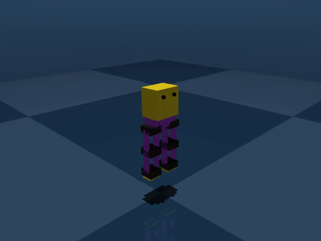 | 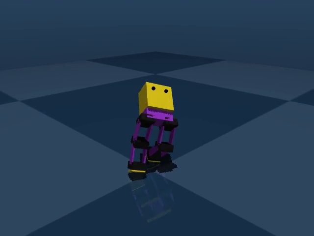 |

### Phase 2: "Weight Shifter" (100K–500K steps)
**Strategy:** Lean forward for small velocity rewards. No foot lifting.

| Start | Mid — leaning forward |
|:---:|:---:|
| 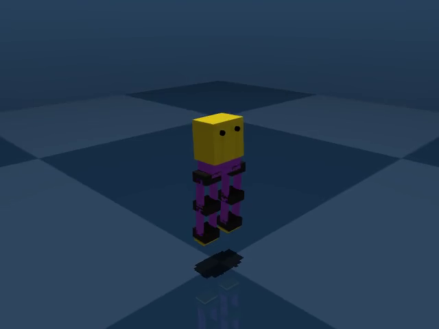 |  |

### Phase 3: "Controlled Fall" (500K–2M steps)
**Strategy:** Tip forward for massive velocity. Short but high-scoring episodes.

| Start — still upright | Mid — collapsed forward |
|:---:|:---:|
| 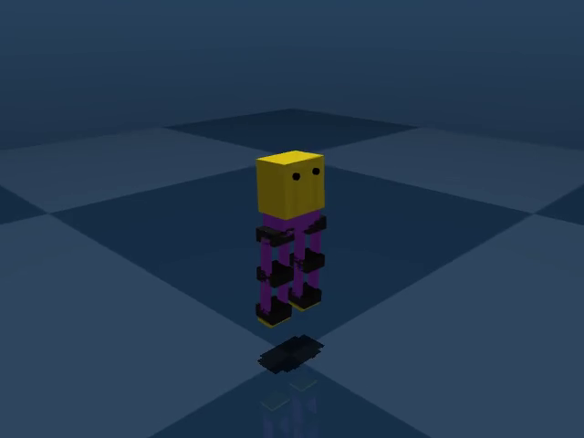 | 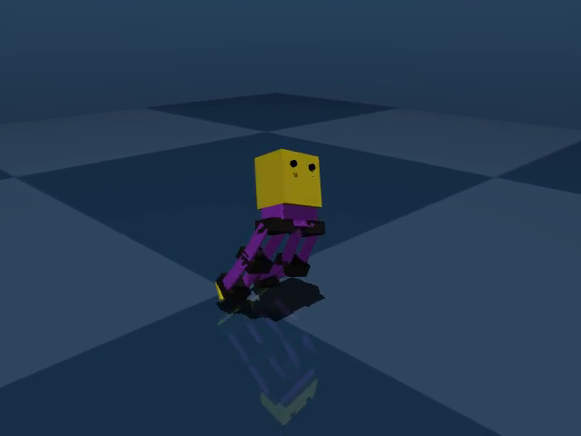 |

### Phase 4: "Crouching Shuffle" (2M–7M steps)
**Strategy:** Low center of gravity, first real leg alternation.

| Start | Mid — low stance, legs moving |
|:---:|:---:|
| 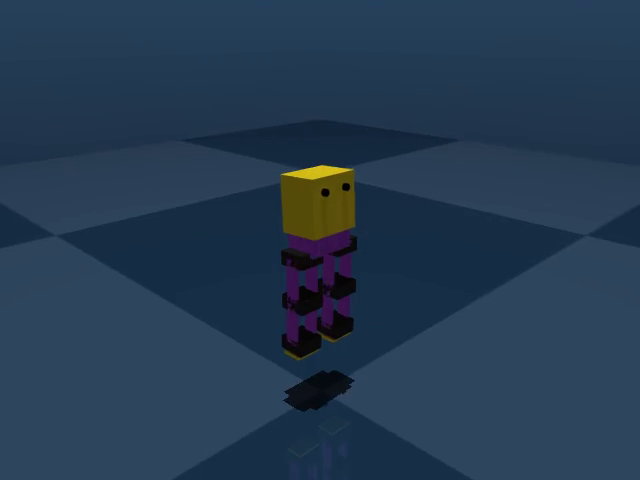 | 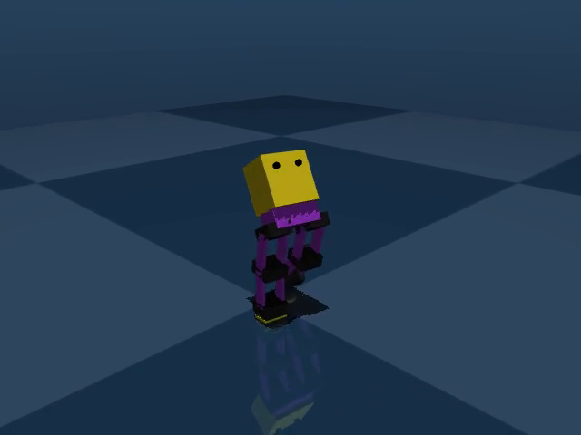 |

### Phase 5: "The Strider" (7M–16M steps)
**Strategy:** Coordinated walking with hip-knee flexion/extension.

| 10M — confident stance | 10M mid — active stepping |
|:---:|:---:|
| 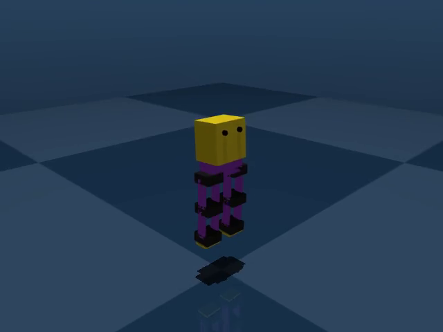 |  |

| 16M — stable upright | 16M mid — walking |
|:---:|:---:|
| 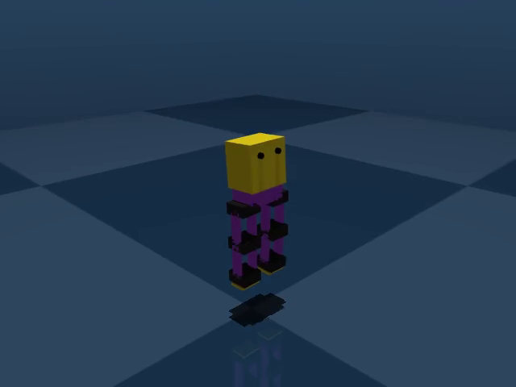 | 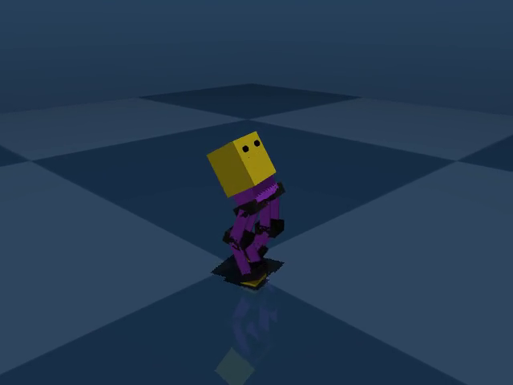 |

### Phase 6: "Aggressive Walker" (16M–25M steps)
**Strategy:** Push speed, accept occasional falls. High reward variance.

| 20M start | 20M mid — fast stride |
|:---:|:---:|
|  | 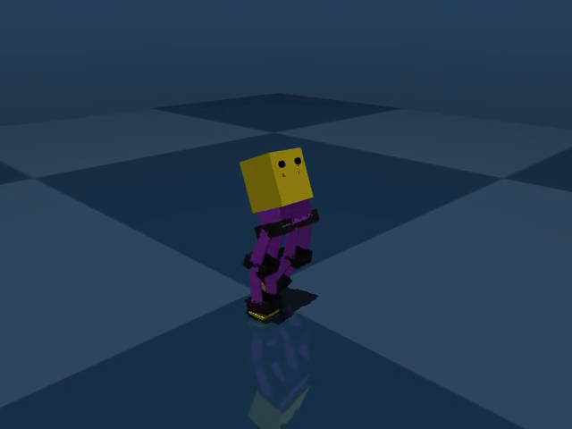 |

| 24.9M start | 24.9M mid — aggressive gait |
|:---:|:---:|
| 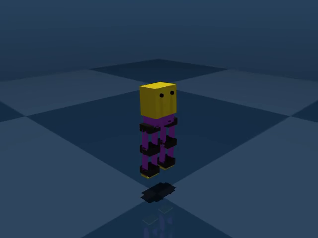 | 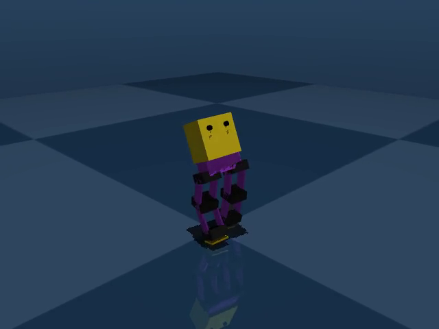 |

---

## The Failed Resume (Run #6)

Attempted to resume from best checkpoint (874.6 reward) with lower LR. The model degraded continuously:

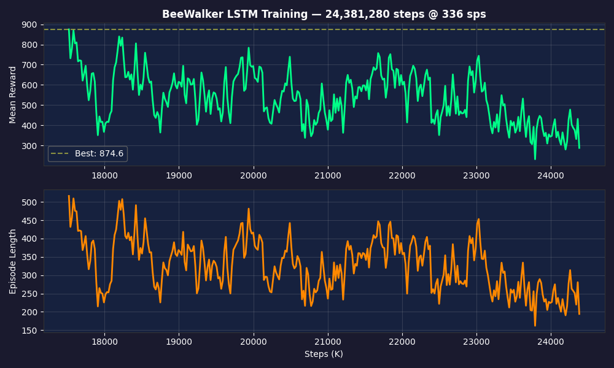

| 17.6M — wide stance, walking (R 45.2) | 22M — legs compressing (R 43.6) | 24.1M — nearly stationary (R 40.2) |
|:---:|:---:|:---:|
| 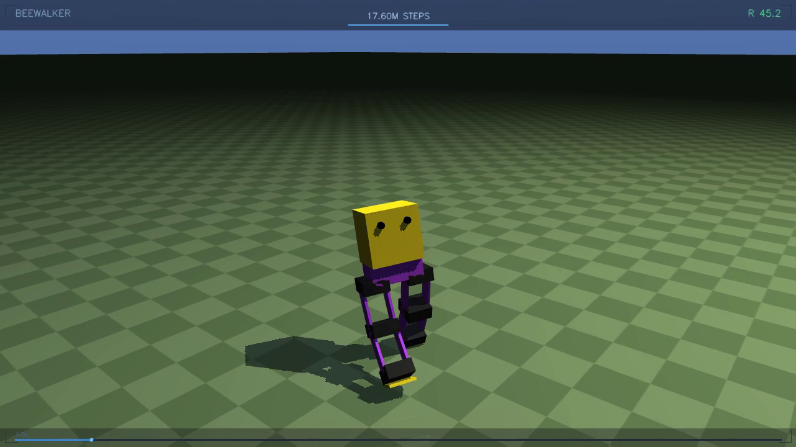 | 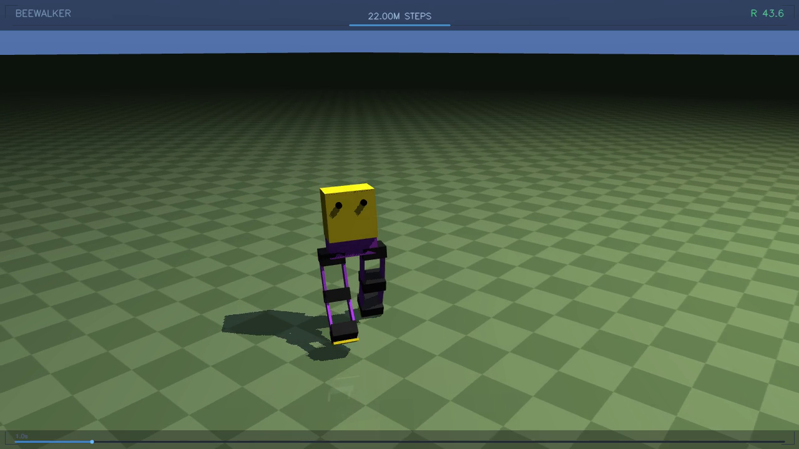 | 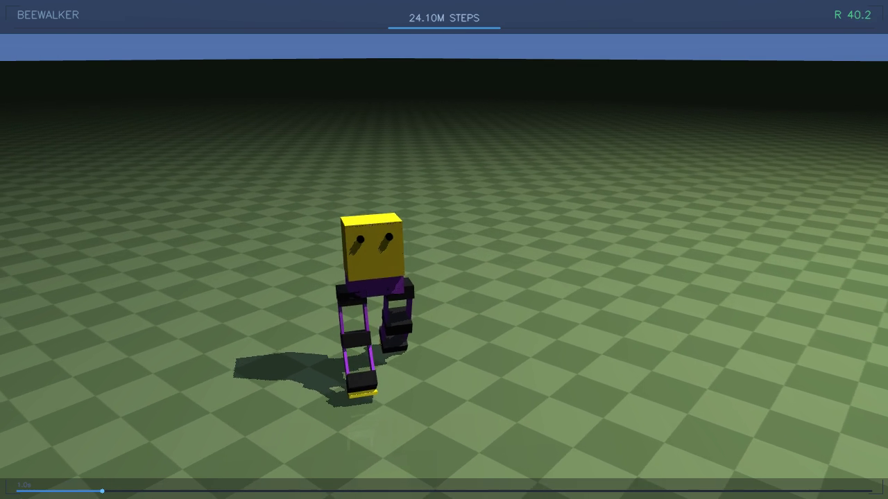 |

---

## ✅ What Works

### LSTM > MLP
The LSTM model discovers coordinated multi-step gaits that MLP struggles with. LSTM reached reward 874.6 in 17.5M steps; MLP needed 100M+ steps for comparable results. The temporal memory lets it plan gait cycles — this is a **clear win**.

### "Speed" reward config
Out of 6 tested configs (natural, speed, explorer, efficient, symmetric, aggressive), **speed** (velocity_weight=5.0, upright=0.3, stepping=1.0, ctrl_cost=0.0001) produces the most functional walking. High velocity weight gives the clearest learning signal.

### More parallel environments
- 4 envs → 24.9M steps for best 669.8
- **10 envs → 17.5M steps for best 874.6**

10 envs is strictly better: faster training AND higher quality. More diverse rollouts = better gradient estimates.

### Reference motion tracking
A sine-wave reference bonus (e.g., `1.5 * exp(-2.0 * error)` at 1.5Hz) guides the model toward human-like gaits early, avoiding the "falling as locomotion" exploit.

### Domain randomization
Random 0.5N pushes every ~1 second prevent fragile, perfectly-tuned gaits.

### Model size fits RP2040
Best model: ~265KB (float32), ~65KB quantized. Architecture: 22 obs → [64] → LSTM(32) → 6 actions. Well within RP2040's 2MB flash / 264KB RAM.

---

## ❌ What Doesn't Work

### Resuming checkpoints with SB3's RecurrentPPO
**The biggest failure.** SB3 `.load()` ignores the `--lr` argument — it uses the saved model's LR (3e-4) instead of the intended 1e-4. The 3x-higher LR caused catastrophic forgetting. The LSTM hidden states also don't transfer properly when SubprocVecEnv resets all environments.

**Fix required:** After `.load()`, manually set `model.learning_rate = desired_lr` and potentially `model.lr_schedule`.

### Training too long without early stopping
Both the 405M MLP run and the 24.1M resumed run show: **more steps ≠ better performance past a point**. Without auto-reverting to the best checkpoint, continued training destroys good policies.

### The standing-still exploit (FIXED ✅)
The model could earn ~300-400 reward by standing (upright + height + survival bonuses). **Fixed in Run #7** with a `-2.0` penalty when `|forward_vel| < 0.05`. Run #7's best (436.4) is lower than Run #5 (874.6) because standing-still reward is no longer inflating the scores — but the model genuinely walks now.

### High reward variance
Even in the best runs, reward oscillates ±200. The model never truly converges — it cycles between "good walk" and "fell over early." Competing reward objectives (speed vs stability) cause this.

---

## ❓ What's Unknown / Left to Explore

1. **LR scheduling for fine-tuning** — We've never successfully fine-tuned a checkpoint. Would cosine annealing (3e-4 → 1e-5) help?

2. ~~**Curriculum learning**~~ → **Now being tested in Run #8!** Progressive difficulty: push strength 0.1→1.0N, push frequency every 2s→0.5s, tilt threshold 0.1→0.3 over 30M steps.

3. **The "natural" reward config with LSTM** — Never tested with LSTM. Could knee_bend + foot_clearance bonuses help?

4. **Larger model capacity** — Current: LSTM(32), pi=[64]. RP2040 could handle LSTM(64), pi=[128,64].

5. **100M+ LSTM steps from scratch** — We've never let an LSTM run past 25M. Run #8 will test this.

6. ~~**Standing penalty**~~ → **Answered in Run #7!** Yes, `-2.0 if |vel_x| < 0.05` forces real walking.

7. **Entropy coefficient decay** — Decaying ent_coef from 0.025→0.005 might help convergence.

8. **Sim-to-real gap** — Unvalidated. MuJoCo vs real MG996R accuracy unknown.

---

## Current Best Model

**Best reward:** `results/lstm_20260209_004543/checkpoints/lstm_17500000_steps.zip` — R=874.6 (inflated by standing exploit)
**Best walking:** `results/lstm_20260209_191705/best_model.zip` — R=436.4 (genuine walking, Run #7)
**Architecture:** MlpLstmPolicy, hidden=32, pi=[64], vf=[64] | **Size:** ~265KB (float32), ~65KB (int8)
**HuggingFace:** [ThomasVuNguyen/beewalker](https://huggingface.co/ThomasVuNguyen/beewalker)
